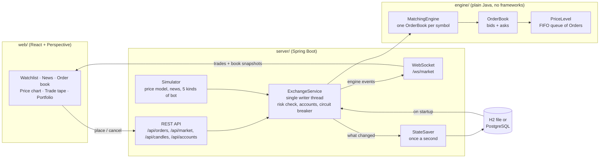
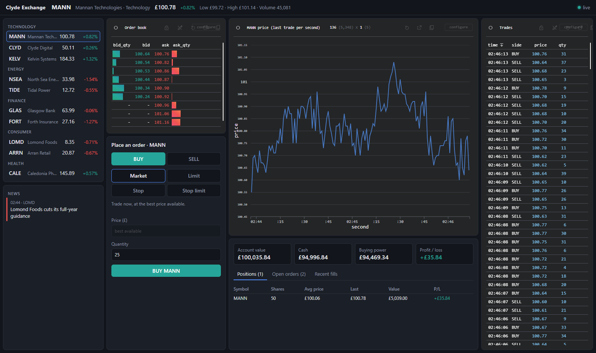

# Clyde Exchange

[](https://github.com/MannanHanda/clyde-exchange/actions/workflows/ci.yml)

A stock exchange simulator written in Java 21. At its core is a **price-time priority matching engine**: the same basic mechanism real exchanges use to decide who trades with whom, at what price, and in what order.

Ten made-up companies in five sectors trade around the clock. Bots with different strategies trade against each other, news stories move prices, and a circuit breaker halts a share that moves too fast. A live dashboard built with [Perspective](https://perspective.finos.org/) (the streaming analytics library open-sourced by J.P. Morgan) shows the watchlist, news, order book, price chart and trade tape. You get a paper-trading account with £100,000 of pretend money and can trade against the bots from the browser, with your cash, positions and profit tracked live.

Everything is saved to a database once a second, so the market can be restarted, or crash, and carry on where it was. It runs as a pair of Docker containers with `docker compose up`.


---

## Architecture


```mermaid
flowchart LR
    subgraph web["web/ (React + Perspective)"]
        UI["Watchlist · News · Order book<br/>Price chart · Trade tape · Portfolio"]
    end

    subgraph server["server/ (Spring Boot)"]
        REST["REST API<br/>/api/orders, /api/market, /api/candles, /api/accounts"]
        WS["WebSocket<br/>/ws/market"]
        BOTS["Simulator<br/>price model, news, 5 kinds of bot"]
        SVC["ExchangeService<br/>single writer thread<br/>risk check, accounts, circuit breaker"]
        SAVE["StateSaver<br/>once a second"]
    end

    DB[("H2 file or<br/>PostgreSQL")]

    subgraph engine["engine/ (plain Java, no frameworks)"]
        ME["MatchingEngine<br/>one OrderBook per symbol"]
        OB["OrderBook<br/>bids + asks"]
        PL["PriceLevel<br/>FIFO queue of Orders"]
    end

    UI -- "place / cancel" --> REST
    WS -- "trades + book snapshots" --> UI
    REST --> SVC
    BOTS --> SVC
    SVC --> ME
    ME --> OB --> PL
    SVC -- "engine events" --> WS
    SVC -- "what changed" --> SAVE --> DB
    DB -- "on startup" --> SVC
```

### Why it's split this way

- **The `engine` module has no dependencies at all**, apart from JUnit for tests. Only the `server` module depends on Spring. The matching logic is pure Java. Given the same inputs, it always produces the same outputs. That makes it easy to test, and it can later be benchmarked or placed behind a message queue without changing it.
- **Single writer.** Only one thread ever touches the order book. REST requests and bots hand their orders to `ExchangeService`, which processes them one at a time. This avoids locks and race conditions completely. The approach is a small version of the "single writer principle" used in the LMAX exchange architecture.

---

## Matching rules

- **Price-time priority.** The best price trades first. At the same price, whichever order arrived first trades first (FIFO).
- **Limit orders** trade while they *cross* the book: a buy matches when its price ≥ the best ask, and a sell matches when its price ≤ the best bid. Whatever is left rests on the book.
- **Trades execute at the resting order's price.** The order that was already waiting sets the price.
- **Market orders** sweep the opposite side until filled. Any leftover is cancelled, never rested. A market order into an empty book fills nothing and leaves no trace.
- **Self-trade prevention.** Every order belongs to an account, and an account can never trade with itself. If an incoming order reaches one of its own resting orders, it stops there and its remainder is cancelled (the "cancel newest" policy).
- **Stop orders** wait *off* the book, where nobody can see or trade with them. A sell stop triggers when the last trade price falls to its stop price or below; a buy stop triggers when it rises to its stop price or above. When it triggers, a `STOP` becomes a market order and a `STOP_LIMIT` becomes a limit order. A stop that would trigger straight away is rejected.
- **Stop cascades.** A triggered stop can trade, move the price and trigger more stops. The engine keeps going until no more stops trigger, oldest first, all inside the same call.
- **Validation:** quantity must be > 0. A fill can never exceed an order's remaining quantity.

## Data structures

| What | Choice | Why |
|---|---|---|
| Prices | `long` in ticks (£101.25 → `10125`) | `double` can't represent values like 0.1 exactly, so equality checks on prices would break. Real exchanges use integer ticks. |
| Orders at one price | `ArrayDeque<Order>` inside `PriceLevel` | Gives FIFO order for free, so arrival order *is* the time priority. |
| Total quantity at a price | cached `totalQty` field | Quantity at a price can be read instantly, in O(1). Every fill goes through `PriceLevel`, so the cached total can't drift out of date. |
| Price levels | `TreeMap<Long, PriceLevel>`; bids use `Comparator.reverseOrder()` | Kept sorted, so the best price is always the first entry, in O(log n). |
| Cancel lookup | `HashMap<orderId, Order>` | O(1) lookup by id. |

**Alternatives considered**
- `PriorityQueue<Order>`: no grouping by price level, cancels are O(n), and ties need a separate comparator.
- An array indexed by price tick: O(1) for everything, and the approach high-frequency engines use, but it needs a fixed price range.

## Accounts and paper trading

Every order belongs to an account, and every trade moves cash from the buyer to the seller and shares the other way.

- **Pre-trade risk check.** Before an order reaches the engine, the server checks the account can cover it in the worst case. There is no borrowing: you can't buy with money you don't have or sell shares you don't hold. A market buy is checked against what it would really cost by walking the ask side of the book.
- **Reserved funds.** Cash promised to resting buy orders, and shares promised to resting sell orders, can't be used twice. `buyingPower = cash - reservedCash`. Reservations are not stored: they are worked out from the engine's open orders each time, so they can't drift out of step with the book.
- **Why the check is safe.** The check and the match run back to back on the single writer thread, so nothing can change between "can they afford it?" and "do it". No locks needed.
- **Profit and loss.** Positions use the average-cost method. Selling realises profit against the average price paid; what you still hold is valued at the last trade price (unrealised).
- **Stops are reserved too.** A waiting sell stop holds its shares and a waiting buy stop-limit holds its cash, so the order can always be honoured when it triggers. A trader can't place a buy stop *without* a limit, because nobody can say in advance what it would cost.
- **Bots have accounts too.** The market maker and noise traders (`bot-maker`, `bot-noise-1`…) skip the risk check, so they can go short. The value, momentum and investor bots get a fixed pot of cash and shares and pass the same risk check as you, so they can run out of money.
- **Trader accounts** are made by registering (see below), and start with £100,000 (`exchange.auth.signup-cash`). Accounts can also be listed in `application.yml` under `exchange.accounts.starting-cash`; whoever registers that name first takes the account over as it is.
- **At most 200 open orders** per trader, so nobody can fill the server's memory with orders.

---

## Logins, API keys and the leaderboard

You can watch the market without logging in. To trade, you create an account with a username and password. Your account is the one with the same id as your username, and nothing in a request can name a different one: the server works out whose order it is from how the request proved who it was.

- **Two ways to prove who you are.** People log in with a password and get a **session**: a random 192-bit token in a cookie. Programs use an **API key** sent in an `X-API-Key` header. Keys are made and deleted on the dashboard, and only a logged-in person can do that, so a leaked key can be cut off but can't make more keys.
- **Nothing secret is stored as it is.** Passwords are hashed with **BCrypt**, which is slow on purpose so a stolen database can't be guessed through quickly. Session tokens and API keys are long and random, so a fast **SHA-256** hash is enough, and the database only holds that. Someone with a copy of the database still can't log in as anyone. A new API key is shown once, when it is made.
- **The cookie** is `HttpOnly` (the page's own JavaScript can't read it, so an injected script can't steal it), `SameSite=Strict` (the browser won't send it on requests started by another website, which stops cross-site request forgery) and `Secure` when the site is on HTTPS. It lasts 30 days, and logging out deletes the session on the server too, so a copied cookie stops working.
- **Guessing is slowed down.** After 10 wrong passwords for one username, that username is locked for 15 minutes. A wrong password and an unknown username give the same answer and take the same time, so the login form doesn't reveal who has an account.
- **One account can't swamp the exchange.** Each account may send at most 20 orders and cancels a second (`exchange.api.orders-per-second`); past that it gets `429 Too Many Requests`. Registration can be closed, and closes itself at 1,000 users (`exchange.auth`).
- **Leaderboard.** Every registered trader, ranked by return: account value now against what they started with. Ranking by percentage, not pounds, keeps it fair between accounts of different sizes. Bots aren't on it. It is worked out at most every 2 seconds however many people are looking, because valuing every account uses the exchange's one writer thread.
- **Your own bots.** [`examples/bot.py`](examples/bot.py) is a small Python trading bot (no libraries needed) to copy and change. Create a key in the dashboard's **API keys** tab, then `CLYDE_API_KEY=clyde_... python examples/bot.py`.
- Users, sessions and keys are written to the database straight away (not once a second like the market), because logging in is rare and must not be lost.

## Circuit breaker

Each symbol has its own circuit breaker, like the "limit up / limit down" rules on real exchanges. If the price moves **5% or more within 60 seconds**, trading in that symbol is **halted for 15 seconds**: new orders are rejected with a message, cancels are still allowed, and the other symbols carry on. A headline goes on the news feed. The numbers are set in `application.yml` under `exchange.circuit-breaker`.

The check runs on the single writer thread right after each trade, so no order can slip in between the trade that trips the breaker and the halt.

---

## Persistence: surviving a restart

The exchange trades in memory and saves to a SQL database a moment later (a pattern called *write-behind*).

- **The matching thread never touches the database.** As trades happen it only notes *what changed*: which accounts, which candles, any new fills. Once a second a separate `StateSaver` thread collects those changes and writes them in **one transaction**. A slow database can't slow down trading, and the database always holds one consistent snapshot, never half of one.
- **On startup** the server loads the snapshot: every account's cash and positions, traders' open orders (put back on the book with their original ids) and fills, each symbol's last price and day statistics, the candles and the news. The bots then carry on from the last price.
- **What is lost in a crash:** at most the last second. On a normal shutdown there is one final save, so nothing is lost. The bots' own open orders and the individual trades between bots are deliberately not saved: the bots re-quote within a second, and the candles summarise the trades.
- **If the database goes away,** trading carries on. Unsaved snapshots queue up and are written in order when it comes back.
- **Two databases, one set of SQL.** By default it is an [H2](https://h2database.com) database in a single file (`./data/clyde.mv.db`), so there is nothing to install. Set `SPRING_DATASOURCE_URL` and it uses PostgreSQL instead. The tables are created by [Flyway](https://flywaydb.org/) from `server/src/main/resources/db/migration`. `PostgresTest` starts a real PostgreSQL and runs a full save-and-restart against it, so the SQL is checked on both.
- **The service doesn't know about SQL.** `ExchangeService` talks to a small `ExchangeStore` interface; `JdbcExchangeStore` is the only class with SQL in it. Most tests run the exchange with no store at all.

Delete the `data/` folder to start the market afresh.

## Candles and the trading day

- **Candles.** Every trade updates a 1-minute and a 1-hour candle (open, high, low, close, volume) for its symbol. The server keeps the newest 1,440 one-minute candles (a day) and 720 one-hour candles (a month) per symbol in memory. `GET /api/candles/{symbol}` builds 5m and 15m candles from the 1-minute ones, and 4h and 1d candles from the 1-hour ones.
- **Trading day.** The market never closes, so a "day" is a calendar day in UTC. At midnight each symbol's open, high, low and volume start again and the last price is remembered as the **previous close**. The change % on the dashboard is measured from the previous close, as on a real exchange.

---

## Running it

You need JDK 21 and Node 22+. Maven is not required, because the project includes the Maven Wrapper.

```bash
./mvnw test                 # run all tests (Windows: .\mvnw test)
./mvnw -pl engine test      # engine tests only

./mvnw install -DskipTests && ./mvnw -pl server spring-boot:run   # 1. exchange + bots on :8080

cd web && npm install && npm run dev                              # 2. dashboard on http://localhost:5173
```

Or, with Docker, the exchange, the dashboard and a PostgreSQL database in one command:

```bash
docker compose up --build -d      # then open http://localhost:8080
```

[docs/deploy.md](docs/deploy.md) explains what is kept across restarts and how to run it on a server around the clock.

## REST API

All prices are in **ticks of 1p** (`10100` = £101.00). Symbols are configured in `server/src/main/resources/application.yml`.

🔒 = needs you to be logged in (the `clyde_session` cookie) or an API key (`X-API-Key` header); without one the answer is `401`. 🍪 = needs the cookie: an API key is not enough.

| Method | Path | What it does |
|---|---|---|
| `POST` | `/api/auth/register` | Body `{"username","password"}`. Username: 3 to 20 lower-case letters, digits or `_`. Password: 8 to 72 characters. Creates your account and logs you in (sets the cookie). |
| `POST` | `/api/auth/login` | Body `{"username","password"}`. Sets the cookie, or `401`. `429` after 10 wrong passwords. |
| `POST` | `/api/auth/logout` | Ends the session on the server and deletes the cookie |
| `GET` | `/api/auth/me` | `{"username": "you" or null, "signupOpen": true}` |
| `POST` 🔒 | `/api/orders` | Place an order. Body: `{"symbol","side","type","price","stopPrice","qty"}`; `type` is `MARKET`, `LIMIT`, `STOP` or `STOP_LIMIT`. `price` is needed for `LIMIT` and `STOP_LIMIT`, and `stopPrice` for the two stop types. Returns the order id, any trades, and `restingQty` (how much is now waiting on the book). |
| `DELETE` 🔒 | `/api/orders/{symbol}/{id}` | Cancel one of your resting orders: `204`, or `404` if unknown, already filled, or not yours |
| `GET` 🔒 | `/api/account` | Your cash, buying power, positions, profit/loss, open orders and recent fills |
| `GET` 🍪 | `/api/keys` | Your API keys: id, name, the first 12 characters, and when it was made |
| `POST` 🍪 | `/api/keys` | Body `{"label"}`. Makes a key and returns it, the only time it is ever shown. At most 5. |
| `DELETE` 🍪 | `/api/keys/{id}` | Deletes a key; programs using it get `401` from then on |
| `GET` | `/api/leaderboard?limit=20` | Registered traders ranked by return: `rank`, `username`, `equity`, `startingCash`, `returnPercent` |
| `GET` | `/api/book/{symbol}?depth=10` | Top price levels on each side, best first |
| `GET` | `/api/trades/{symbol}?limit=50` | Recent trades, newest first |
| `GET` | `/api/market` | One row per symbol: name, sector, last, today's open, high, low and volume, the previous close, and whether it is halted |
| `GET` | `/api/candles/{symbol}?interval=1m&limit=300` | Price history, oldest first. `interval` is `1m`, `5m`, `15m`, `1h`, `4h` or `1d`. Each candle has `start`, `open`, `high`, `low`, `close`, `volume`. |
| `GET` | `/api/news?limit=20` | Latest headlines, newest first |
| `GET` | `/api/symbols` | Tradable symbols |
| `GET` | `/actuator/health` | `{"status":"UP"}` while the server and its database connection are healthy |

Invalid or unaffordable orders get `400 Bad Request` with a message, e.g. `{"detail":"Quantity must be > 0, was 0"}` or `{"detail":"Insufficient shares: trying to sell 80 MANN but only 60 available"}`.

```bash
# make an API key in the dashboard's "API keys" tab, then:
KEY=clyde_...

# buy 100 MANN from the bots at the best available prices, then offer 40 of them for sale at £105.00
curl -X POST localhost:8080/api/orders -H "X-API-Key: $KEY" -H 'Content-Type: application/json' \
     -d '{"symbol":"MANN","side":"BUY","type":"MARKET","qty":100}'
curl -X POST localhost:8080/api/orders -H "X-API-Key: $KEY" -H 'Content-Type: application/json' \
     -d '{"symbol":"MANN","side":"SELL","type":"LIMIT","price":10500,"qty":40}'
curl localhost:8080/api/account -H "X-API-Key: $KEY"   # cash down, 100 MANN held, 60 available, one open order

# a stop-loss: sell the other 60 at market if MANN ever trades at £95.00 or below
curl -X POST localhost:8080/api/orders -H "X-API-Key: $KEY" -H 'Content-Type: application/json' \
     -d '{"symbol":"MANN","side":"SELL","type":"STOP","stopPrice":9500,"qty":60}'
```

## Live market data and bots

When the server starts, a simulator trades all ten symbols on its own, four ticks a second (turn it off with `exchange.sim.enabled: false`). The companies and their sectors are listed in `application.yml` under `exchange.instruments`.

**The price model.** Each company has a hidden *fair value*: what it is "really" worth. Nobody trades at it directly; it is what the smarter bots steer by. Every tick it moves by the sum of three random steps:

- a **market** step shared by all ten companies,
- a **sector** step shared by companies in the same sector,
- the company's **own** step.

So shares in the same sector tend to rise and fall together, as they do in real markets. On top of that there are **stormy spells** (every step gets 2.5 times bigger for a while, so calm and wild periods come in clusters), slow **trends** that last a few minutes, a weak pull back towards the starting price, and **news**: now and then a story breaks and a company (or a whole sector) jumps by 1 to 9%.

**The bots.** The traded price is not the fair value. It is whatever the bots' orders make it:

- **Market maker:** always quotes five levels of bids and asks, so there is always someone to trade with. It doesn't know the fair value exactly. It keeps its own reference price, which it nudges when people trade against it, when news breaks, and slowly towards fair value. It widens its spread when the price is moving fast.
- **Noise traders:** buy and sell at random. They create most of the trades.
- **Value trader:** buys when the price is below fair value and sells when it is above. This is what pulls the price back towards what the company is worth.
- **Momentum trader:** compares a fast and a slow moving average of the price, buys when the price is rising and sells out when it falls. It makes trends run further.
- **Investor:** every so often buys or sells a big position in small slices over a minute or two, pushing the price in one direction.

The last three have limited money and pass the same risk check as a human trader. A one-hour headless simulation runs in the tests (`SimulationTest`) and checks the books stay two-sided, the price tracks fair value and no limited bot is ever overdrawn.

Connect to `ws://localhost:8080/ws/market` to receive, at most every 200 ms:

```json
{"type":"trades","trades":[{"symbol":"MANN","buyOrderId":1751,"sellOrderId":1822,"price":9903,"qty":6,"timestamp":1793076835022}]}
{"type":"book","book":{"symbol":"MANN","bids":[{"price":9895,"qty":74}],"asks":[{"price":9903,"qty":180}]}}
```

**Why batched?** The matching thread never touches the network. It drops each trade into a lock-free queue, and a separate timer sends batches. A slow browser can't slow down matching, and the browser gets at most 5 updates a second instead of one per trade.

## Dashboard

`web/` is a small React app built with Vite. Perspective does the heavy lifting: it runs a columnar data engine in WebAssembly inside a Web Worker, so the browser can filter, sort and aggregate thousands of streaming rows without blocking the page.

- **One stream, many views.** `useMarketStream` opens the WebSocket (reconnecting with exponential backoff) and writes into two in-browser Perspective tables: `trades` (capped at 60,000 rows) and `book` (indexed by `symbol:level`, so each snapshot overwrites rows in place). A third table, `candles`, is filled from `GET /api/candles`. Every panel is a `<perspective-viewer>` over one of those tables with a different config. Switching symbol just changes a filter.
- **Watchlist:** every symbol grouped by sector with its last price and change, and a `HALTED` badge while its circuit breaker is tripped. Click a symbol to trade it. It polls `GET /api/market` once a second.
- **News:** the latest headlines. Click a company story to jump to that symbol.
- **Order book:** best 10 levels each side, with in-cell bars showing size at each price.
- **Price chart:** a candlestick chart of the price history, with buttons for 1m, 5m, 15m, 1h, 4h and 1d candles. Because candles are saved, the history is still there after a restart. The `Live` button shows the last trade price per second instead, using Perspective's `bucket()` expression and a `last` aggregate.
- **Trade tape:** newest first, with the aggressor side. The server doesn't send a side, but order ids only go up, so the newer of the buy and sell ids is the order that arrived and crossed the spread.
- **Log in / create account:** takes the order ticket's place until you log in. Everything else works logged out.
- **Order ticket:** sends real `MARKET`, `LIMIT`, `STOP` or `STOP_LIMIT` orders to `POST /api/orders` and reports what filled, what is waiting and what was cancelled. It is disabled while the symbol is halted.
- **Portfolio:** account value, cash, buying power and profit/loss, plus tabs for your positions, open orders (with a cancel button, and including waiting stops), recent fills, your API keys, and the leaderboard. It polls `GET /api/account` once a second. Logged out, it shows just the leaderboard.
- On page load it backfills the last 500 trades per symbol over REST, de-duplicating against the live stream.



## Project layout

```
engine/   matching engine (plain Java)
  model/    Order, Side, OrderType, Trade
  book/     PriceLevel, OrderBook, MatchingEngine, BookSnapshot, OpenOrder
server/   Spring Boot application
  service/  ExchangeService (single writer, risk check, settlement), CircuitBreaker, Instrument, MarketSummary, TradeRecord,
            Candle, CandleSeries, ExchangeStore (what the service needs from a database)
  store/    JdbcExchangeStore, JdbcNewsStore (the SQL), StateSaver (saves once a second)
  account/  Account, Position (average cost, profit/loss), AccountView
  auth/     AuthService (register, log in, sessions, API keys), UserStore (the SQL), RequestAuth (who is this request from?),
            Leaderboard
  api/      OrderController, MarketDataController, AccountController, AuthController, ApiKeyController,
            RateLimiter, error handling (400, 401, 429)
  news/     NewsFeed (latest headlines), NewsStore
  ws/       MarketDataPublisher (batched WebSocket feed)
  sim/      PriceModel, Simulator, SimulatorRunner, and the bots: MarketMakerBot, NoiseTraderBot,
            ValueTraderBot, MomentumBot, InvestorBot
web/      React + Vite + Perspective dashboard
  src/perspective.js    starts Perspective (WebAssembly) and creates the tables
  src/useMarketStream.js  WebSocket + REST backfill -> tables
  src/useMarketSummary.js polls the market summary and the news
  src/useAuth.js        who is logged in; log in, register, log out
  src/useAccount.js     polls your account while you are logged in
  src/useCandles.js     polls the candles for the chart
  src/Watchlist.jsx     symbols by sector
  src/News.jsx          headlines
  src/OrderTicket.jsx   market, limit and stop orders
  src/Login.jsx         log in / create account form
  src/Portfolio.jsx     cash, positions, open orders, fills, plus the two below
  src/ApiKeys.jsx       create and delete API keys
  src/Leaderboard.jsx   traders ranked by return
  src/App.jsx           layout and the viewer configs
examples/bot.py   a trading bot of your own, using an API key
Dockerfile, docker-compose.yml   the exchange and PostgreSQL as containers (see docs/deploy.md)
```

---

## Status

| Part | State |
|---|---|
| `Order`: fill logic with overfill/negative guards | ✅ done, tested |
| `PriceLevel`: FIFO queue + cached total | ✅ done, tested |
| `OrderBook`: bids/asks, limit-order matching | ✅ done, tested |
| Market orders, cancels, `MatchingEngine` (validation, ids, one book per symbol) | ✅ done, tested |
| REST API + single-writer `ExchangeService` (incl. 8-thread concurrency test) | ✅ done, tested |
| WebSocket market data + trading bots (market maker, noise traders, random-walk fair value) | ✅ done, tested |
| Perspective dashboard: order book, price chart, trade tape, order ticket | ✅ done, verified in browser |
| Accounts: order ownership, cash and positions, buying-power check, self-trade prevention, profit/loss | ✅ done, tested |
| Portfolio panel: balances, positions, open orders with cancel, fills | ✅ done, verified in browser |
| Stop and stop-limit orders, with cascades | ✅ done, tested |
| Ten symbols in five sectors; price model with market, sector and company moves, storms, trends and news | ✅ done, tested |
| Value, momentum and investor bots with limited money; one-hour simulation test | ✅ done, tested |
| Per-symbol circuit breaker and news feed | ✅ done, tested |
| Watchlist, news panel, stop orders in the ticket | ✅ done, verified in browser |
| Persistence: accounts, open orders, fills, prices and news survive a restart (H2 or PostgreSQL) | ✅ done, tested on both |
| Candles (1m to 1d), UTC trading days with previous close, candlestick chart | ✅ done, tested, verified in browser |
| Memory and database caps for running for months | ✅ done, tested |
| Dockerfile and docker-compose (exchange + PostgreSQL) | ✅ done, built and run, upgrade from the previous version tested |
| Login (BCrypt passwords, hashed sessions in an HttpOnly cookie), API keys, rate limits | ✅ done, tested on H2 and PostgreSQL, verified in browser |
| Leaderboard, and an example Python bot that trades with an API key | ✅ done, tested, bot run against a live server |

## Known limitations

- There is no "forgot my password": with no email address stored, a lost password means a new account.
- Login protection is per server: the failed-login count and order rate limit live in memory, so they reset on restart and would not be shared between several servers.
- Prices are all simulated; there is no real market data.
- A crash (not a normal shutdown) can lose up to the last second of activity.
- Only the newest state is saved, not the full order log, so the exact book can't be replayed (see Kafka in the roadmap).
- No short selling or margin for traders (the market maker and noise traders can go short).
- Trading simply resumes after a halt. Real exchanges reopen with an auction.
- A trader can't place a buy stop without a limit price, and there are no linked orders (such as "one cancels the other").
- The market never closes: a trading day is simply a UTC calendar day, with no opening or closing auction.
- Cancelling an order is O(k) in the number of orders at its price level.

## Roadmap

- **Kafka:** turn orders and engine events into topics. The engine is deterministic, so replaying the order log rebuilds the exact same book.
- **JMH benchmarks:** measure matching throughput and latency, and compare `ArrayDeque` against a linked list for fast cancels.
- **LMAX Disruptor:** replace the single-writer queue with a ring buffer, and measure the difference.
